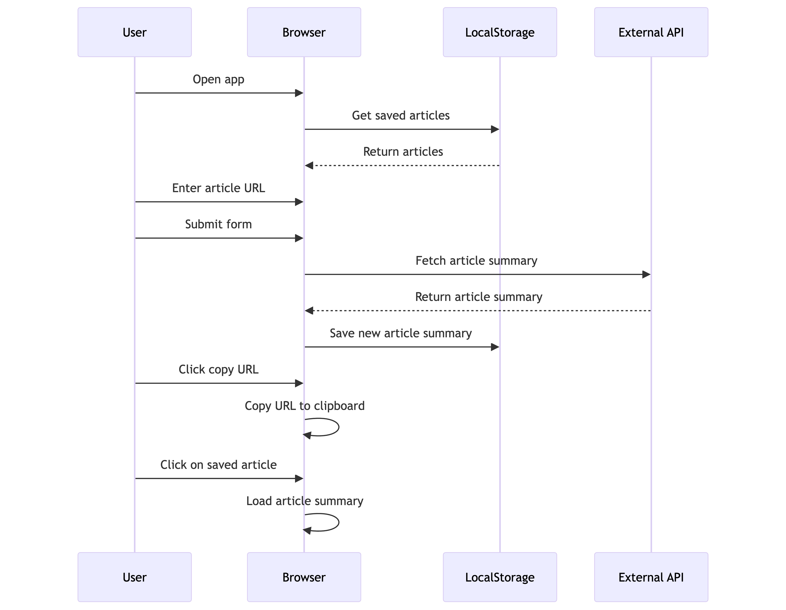

# article-sumz

## Project Description
article-sumz is a web application that allows users to summarize articles efficiently using advanced natural language processing techniques.

## Installation Instructions
To install and run the project locally, follow these steps:

1. Clone the repository:
    ```bash
    git clone https://github.com/yourusername/article-sumz.git
    cd article-sumz
    ```

2. Install the dependencies:
    ```bash
    npm install
    ```

3. Run the development server:
    ```bash
    npm run dev
    ```

4. Open your browser and navigate to `http://localhost:3000` to see the application in action.

## Features
- **Article Summarization**: Summarizes lengthy articles into concise summaries.
- **User-Friendly Interface**: Easy to use interface with clear navigation.
- **Fast Processing**: Quick summarization using optimized algorithms.

## Usage
1. Open the application in your browser.
2. Enter the URL or text of the article you wish to summarize.
3. Click the "Summarize" button to get the summary.
4. View the summarized content on the same page.

## Sequence Diagram



